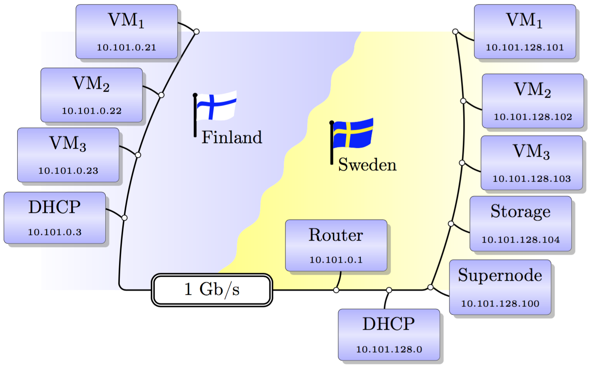
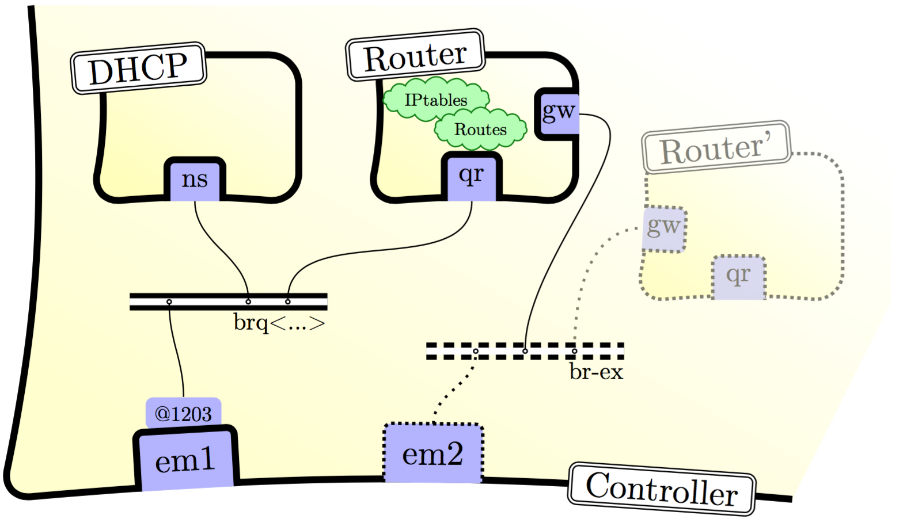
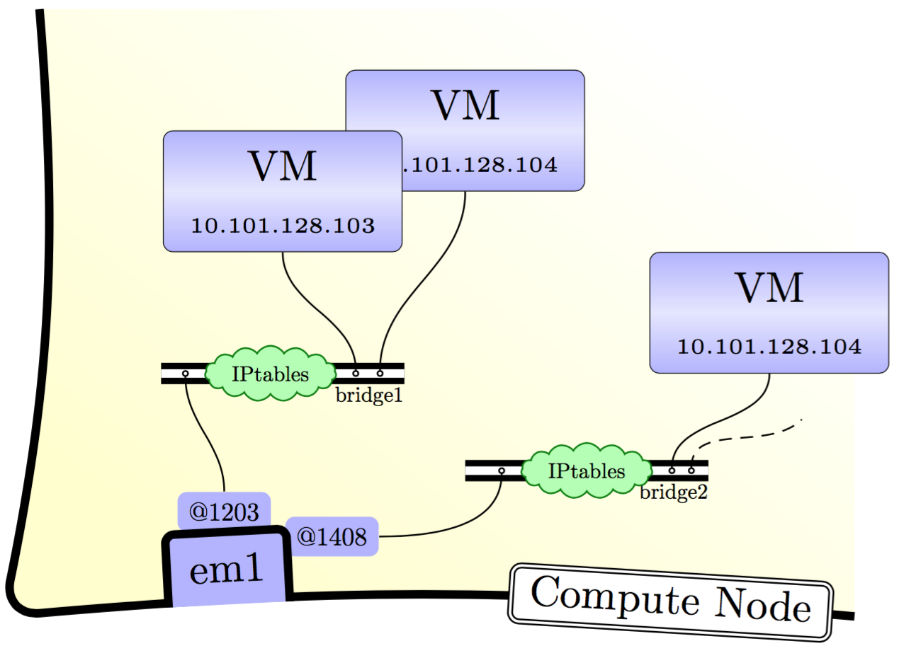

# Knox setup for the Epouta connection

This document describes how we connected a set of virtual machines
(VMs) running on Knox, in Sweden, to another set of VMs running on
ePouta, in Finland. The details can be found in
the
[`paper` branch](https://github.com/NBISweden/Knox-ePouta/tree/paper),
or the associated publication.

The dedicated network uses the `10.101.0.0/16` CIDR. We split the
latter IP address range in two disjoint parts: VMs on ePouta use the
lower part of the range, while VMs on Knox use the higher part. The
exception of the virtual router. The DHCP server on Knox
(resp. ePouta) provides network information for the VMs on Knox
(resp. ePouta). We give the following IPs to the different components:

* the Virtual Router at `10.101.0.1` (on Knox),
* the Knox DHCP server is at `10.101.128.0`,
* the ePouta DHCP server is at `10.101.0.3`,
* the set of VMs on ePouta range from `10.101.0.4` to `10.101.127.255`, and
* the set of VMs on Knox range from `10.101.128.1` to `10.101.128.254`.

# The Virtual Router and DHCP server, <i>on Knox</i>

Openstack uses the network namespace capabilities of the Linux kernel,
in order to isolate routes, firewall rules and interfaces from the
root namespace. This is where the virtual router and the dhcp server
live, each in its own namespace.

We use
[Openstack Liberty](http://docs.openstack.org/liberty/install-guide-ubuntu/) on
Knox.

> Note: You should sort out whether you need to be `root` or not to
> run all the following commands successfully. We use `<...>` to
> denote a _universally unique identifier_ (such as
> 1a6abf7e-f927-4598-9a6c-c4311e685e52), otherwise we use
> `<description>` whenever a parameter must be substituted with
> _description_ by the reader. The network components (often) start
> with `q`, for historical reasons: _Neutron_ used to be called
> _Quantum_.

The following commands run on the Knox `controller`.

    source <Knox.credentials>
    # Create a router (Note its ID)
    neutron router-create knox-router
	
    # Create a network (on VLAN 1203)
    neutron net-create --provider:network_type vlan \
                       --provider:physical_network vlan \
                       --provider:segmentation_id 1203 \
                       knox-net
						 
    # Specify the IP range
    neutron subnet-create \
            --name knox-subnet \
            --allocation-pool start=10.101.128.0,end=10.101.255.254 \
            --gateway 10.101.0.1 \
            knox-net 10.101.0.0/16
			  
    # Add an interface in the router for that "101" network
    neutron router-interface-add knox-router knox-subnet

The neutron plugin creates veth pairs, where one end is moved to a
network namespace, and the other end is still in the root namespace.
The end in the router namespace is of the form `qr-<...>` and
the one in the dhcp namespace is of the form `ns-<...>`. The
other end of the veth pairs, in the root namespace, is added to a
linux bridge. Openstack creates a linux bridge per project.

Moreover, the plugin makes sure that the outgoing interface, of the
physical host, uses the VLAN tag 1203, and is also added to that same
bridge, therefore providing connectivity and security to the router
(over that VLAN).

Both the virtual router and the DHCP server are connected to the root
namespace via 2 tap interfaces, added to a common bridge. Openstack
also created a VLAN interface (with 1203) on that bridge for the
`10.101.0.0/16` network.

	[controller] $ brctl show
	bridge name	 [...] STP enabled	 interfaces
	brq<...>	 [...] no            em1.1203   # for VLAN separation
	                                 tap<...>   # for the 10.101.0.0/16 router interface
	                                 tap<...>   # for the dhcp namespace

> Note: We think we found a problem with MAC addresses on the linux
> bridge in Ubuntu: The tap interface connected to the virtual router
> is learned on the wrong port of the bridge. Moreover, the MAC
> address of the bridge itself is by construction to lowest one of all
> its interfaces, unless its MAC address is fixed at
> creation. Updating the openstack plugin for fixing the bridge's MAC
> address was not a solution in mind. Instead, we opted for the
> following quickfix: We disabled the MAC learning algorithm of the
> bridge, and made it behave like a hub (and not a virtual switch). We
> don't recall that it was necessary on CentOS.
>
> The following command (as root) provides a solution (albeit non-optimal):
>
> `brctl setageing brq<...> 0`

# External connectivity for the VMs

All VMs have a default route to the virtual router. Therefore,
external connectivity is adjusted in the virtual router's namespace
(on Knox).

Openstack usually creates a veth pair, where one end is a `gateway`
interface added to the virtual router, and the router translates the
source address (_source NATing_ or _SNAT_), using IPTables, for outgoing
traffic over that interface. Traffic to the `10.101.0.0/16` network is
routed through the `qr-<...>` interface, and all other traffic is
routed through the gateway interface.

The other end of the veth pair is still in the root namespace, and is
added to an _external_ bridge, which already forwards traffic to the
host's external interface.  That way, all virtual routers have
external connectivity.

However, in our case, we did not need to use this (classic) openstack
setup. We instead used a single veth pair (denoted `gw <-> mm`), along
with a _fake external/local_ network `10.5.0.0/24`. The `gw` end
belongs to the virtual router and has the IP `10.5.0.2/24`, while `mm`
has `10.5.0.1/24`.

On the controller:

	# Create a veth pair for external access to the virtual router
	ip link add gw type veth peer name mm
	
	# Add the gw interface to the virtual router
	ip link set gw netns qrouter-<...> # Fill in the Virtual Router's ID
	
	# Give an ip to `mm`
	ip addr add 10.5.0.1/24 dev mm

Inside the Virtual router:

	# Give an ip to `gw`, and bring it up
	[virtual-router]$ ip addr add 10.5.0.2/24 dev gw
	                $ ip link set dev gw up # that'll bring `mm` up on the other side too

The routes in the Virtual Router are so far:

	[virtual-router]$ ip route show
	10.5.0.0/24 dev gw  proto kernel  scope link  src 10.5.0.2 
	10.101.0.0/16 dev qr-<...>  scope link  src 10.101.0.1 

We chose to not give a full external connectivity to the VMs. We do
not have a `default` route in the routing table of the virtual
router. Instead, we only added a few extra routes as follows:

	[virtual-router]$ ip route add <knox-endpoint>/32   via 10.5.0.1 dev gw
	                $ ip route add <ePouta-endpoint>/32 via 10.5.0.1 dev gw
	                $ ip route add <dns>/32             via 10.5.0.1 dev gw
	                $ ip route add <proxy>/32           via 10.5.0.1 dev gw

Finally, for external connectivity, it is necessary to _source NAT_ the
traffic coming out of the virtual router.

	[virtual-router] # iptables -t nat -S
	...
	-A POSTROUTING -o gw -j SNAT --to-source 10.5.0.2
	...

# VM connectivity on the compute nodes

On each compute node, a bridge is created (also per project), along
with an interface with VLAN tag 1203. A veth pair's end is added to
the bridge, while to other end is used by a VM, as its internal
interface.

A kernel setting is used to force IPtables to filter traffic on the
bridge. This is the way Openstack enforces security groups and in
particular ensures some address spoofing protections. These rules can
be slightly manipulated by updating the neutron port settings.

	[compute-node] $ brctl show
	bridge name	[...]	interfaces
	brq<...>	        em1.1203
	                    tap<...>   # some VM
						...        # more VMs

# Caveats and Pitfalls

The difficulties we faced using Linux Bridges plugin came from the
fact that Neutron installs IPTables rules in order to implement the
security groups. These rules end up on the compute hosts and filter
inwards and outwards traffic.

One of those rules is in the _source chain_ which filters out traffic
that is not the proper pair of IP and MAC address related to a
particular VM. This is important since a VM cannot then simply add a
network or an interface and connect through it. In the hypothetical
scenario where that VM creates a bridge, the MAC address of the bridge
might flicker between the ones from the added interfaces. Moreover, in
another scenario where the VM network is augmented with another local
network, say `192.168.0.0/24`, the traffic would be filtered by the
source chain. This is relevant in case we want to implement on
openstack installation inside VMs (such as Mosler, or the so-called
_Triple-O_, Openstack on Openstack).

This is adjustable using some neutron commands that will affect the
neutron ports, and extend the source chains with either another CIDR
or another set of MAC addresses.

# Remarks

Broadcast traffic is still forwarded to all interfaces on VLAN 1203 and
therefore to all VMs. An improvment would be to use OpenVSwitch to
learn about MAC addresses and skip physical nodes that don't host any
VMs on that project. That will improve East-West traffic. An
alternative is to distribute the router using DVR (not available when
using the Linux Bridge mechanism).

