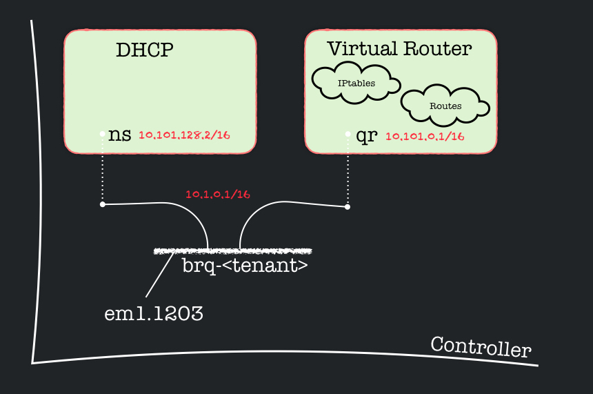
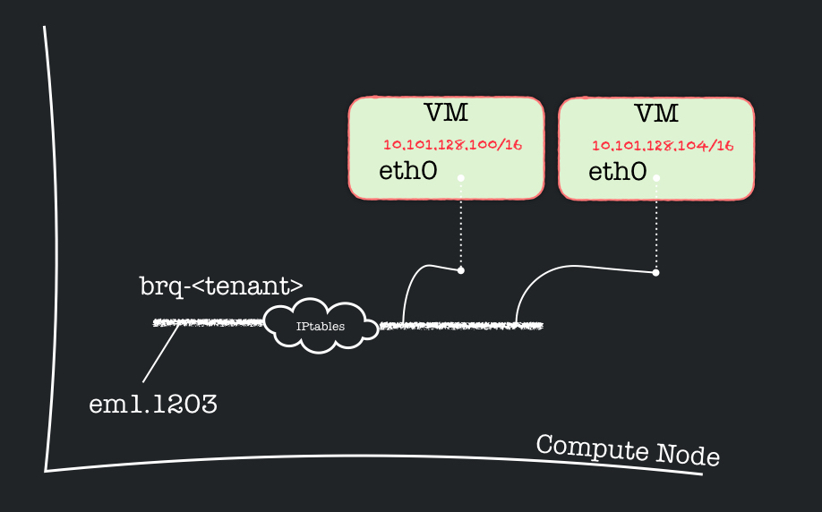

# Knox setup for the Epouta connection

This document describes how we connected a set of virtual machines
(VMs) running on Knox, in Sweden, to another set of VMs running on
ePouta, in Finland.

We start with the low-level component. There is a 1GB/s fiber-link
between Knox and ePouta with a dedicated network. This means that the
link might be shared, but only the VMs on that network can communicate
through it. This security is provided by VLAN encapsulation. In our
case, the VLAN tag is 1203.

We use the following range of IPs: `10.101.0.0/16` for network
communication between the VMs. We split the address range in two
disjoint parts. For that, we use the third number of the
`10.101.0.0/16` CIDR. The VMs in ePouta will have an IP where the
third number starts in binary notation with a `0`, while, for the VMs
in Knox, the third number will start with a `1`. The exception is the
virtual router.

The network settings use the following components:
* a Virtual Router on Knox (with IP: `10.101.0.1/16`)
* a DHCP server on Knox (with IP: `10.101.128.0/16`)
* a DHCP server on ePouta (with IP: `10.101.0.3/16`)
* the Neutron Openstack linuxbridges plugin (on Knox) with VLAN capabilities
* a set of VMs on ePouta (with IPs from `10.101.0.4/16` to `10.101.127.255/16`)
* a set of VMs on Knox (with IPs from `10.101.128.1/16` to `10.101.128.254/16`)

The DHCP server on Knox (resp. ePouta) provides network information
for the VMs on Knox (resp. ePouta).

It is necessary to adjust the network settings in ePouta accordingly.

	[controller]$ source <ePouta.credentials>
	
	[controller]$ neutron subnet-update UU-MOSLER-subnet \
	                      --allocation-pools type=dict list=true
	                      start=10.101.0.2,end=10.101.127.255 \
	                      --dns-nameserver 10.101.128.0
	
	[controller]$ neutron subnet-show UU-MOSLER-subnet
	+-------------------+--------------------------------------------------+
	| Field             | Value                                            |
	+-------------------+--------------------------------------------------+
	| allocation_pools  | {"start": "10.101.0.2", "end": "10.101.127.255"} |
	| cidr              | 10.101.0.0/16                                    |
	| dns_nameservers   | 10.101.128.0                                     |
	| enable_dhcp       | True                                             |
	| gateway_ip        | 10.101.0.1                                       |
	| host_routes       |                                                  |
	| id                | ffffffff-gggg-hhhh-iiii-jjjjjjjjjjjj             |
	| ip_version        | 4                                                |
	| name              | UU-MOSLER-subnet                                 |
	| network_id        | aaaaaaaa-bbbb-cccc-dddd-eeeeeeeeeeee             |
	| subnetpool_id     |                                                  |
	| tenant_id         | aaaaaaaaaaaaaaaaaaaaaaaaaaaaaaaa                 |
	+-------------------+--------------------------------------------------+

Note that we also adjusted the DNS setting. In the namespace related
to the DHCP server lies a `dnsmasq` process, which accepts DNS queries
and either answers them from a small, local, cache or forwards them to
a real, recursive, DNS server. Therefore, we make the VMs DNS queries
point to `10.101.128.0`.

# The Virtual Router and DHCP server, <i>on Knox</i>

Openstack uses the network namespace capabilities of the Linux kernel,
in order to isolate routes, firewall rules and interfaces from the
root namespace. This is where the virtual router and the dhcp server
live, each in its own namespace. Note that we are
using
[Openstack Liberty](http://docs.openstack.org/liberty/install-guide-ubuntu/) on
Knox, and that the naming convention is such that network components
(often) start with `q`. This is for historical reasons: _Neutron_ used
to be called _Quantum_. We use `<...>` to denote a _universally unique
identifier_ (such as `1a6abf7e-f927-4598-9a6c-c4311e685e52`).

The following commands run on the Knox `controller`.

	[controller]$ ip netns
	qrouter-<...>
	qdhcp-<...>

The neutron plugin creates veth pairs, where one end is moved to a
network namespace, and the other end is still in the root namespace.
The end in the router namespace is of the form `qr-<...>` and
the one in the dhcp namespace is of the form `ns-<...>`. The
other end of the veth pairs, in the root namespace, is added to a
linux bridge. Openstack creates a linux bridge per project.

Moreover, the plugin makes sure that the outgoing interface, of the
physical host, uses the VLAN tag 1203, and is also added to that same
bridge, therefore providing connectivity and security to the router
(over that VLAN).

The dhcp namespace isolates a `dnsmasq` process, while the other
namespace isolates routes and IPtables rules for the virtual router.

The following openstack commands create the necessary underlying
components on the Knox `controller` for providing connectivity between
the different VMs, either in Knox or in ePouta. The components are a
network namespace, a bridge, and a veth pair that is dedicated for the
10.101.0.0/16 network.

	[controller]$ source <Knox.credentials>
	
	# Create a router (Note its ID)
	[controller]$ neutron router-create ${OS_TENANT_NAME}-mgmt-router
	# This creates the above-mentioned qrouter-<...>
	
	# Create a network (on VLAN 1203)
	[controller]$ neutron net-create --provider:network_type vlan \
	                                 --provider:physical_network vlan \
					                 --provider:segmentation_id 1203 \
					                 ${OS_TENANT_NAME}-mgmt-net
	
	# Specify the IP range
	[controller]$ neutron subnet-create --name ${OS_TENANT_NAME}-mgmt-subnet \
	                      --allocation-pool start=10.101.128.1,end=10.101.255.254 \
						  --gateway 10.101.0.1 \
						  ${OS_TENANT_NAME}-mgmt-net 10.101.0.0/16
	
	# Add an interface in the router for that 101 network
	[controller]$ neutron router-interface-add ${OS_TENANT_NAME}-mgmt-router \
	                                           ${OS_TENANT_NAME}-mgmt-subnet
											   
	# At this stage, the above-mentioned qdhcp-<...> is created.
	
Both the virtual router and the DHCP server are connected to the root
namespace via 2 tap interfaces, added to a common bridge. Openstack
also created a VLAN interface (with 1203) on that bridge for the
`10.101.0.0/16` network.

	[controller] $ brctl show
	bridge name	    [...] STP enabled	 interfaces
	brq1a6abf7e-f9	[...] no             em1.1203       # for VLAN separation
	                                     tap5a9dea61-d4 # for the 10.101.0.0/16 router interface
	                                     tapaeffc08d-63 # for the dhcp namespace

> Note: We think we found a problem with MAC addresses on the linux
> bridge in Ubuntu: The tap interface connected to the virtual router
> is learned on the wrong port of the bridge. Moreover, the MAC
> address of the bridge itself is by construction to lowest one of all
> its interfaces, unless its MAC address is fixed at
> creation. Updating the openstack plugin for fixing the bridge's MAC
> address was not a solution in mind. Instead, we opted for the
> following quickfix: We disabled the MAC learning algorithm of the
> bridge, and made it behave like a hub (and not a virtual switch). We
> don't recall that it was necessary on CentOS.
>
> The following command (as root) provides a solution (albeit non-optimal):
>
> `brctl setageing brq<...> 0`

# External connectivity for the VMs

All VMs have a default route to the virtual router. Therefore,
external connectivity is adjusted in the virtual router's namespace
(on Knox).

Openstack usually creates a veth pair, where one end is a `gateway`
interface added to the virtual router, and the router translates the
source address (_source NATing_ or _SNAT_), using IPTables, for outgoing
traffic over that interface. Traffic to the `10.101.0.0/16` network is
routed through the `qr-<...>` interface, and all other traffic is
routed through the gateway interface.

The other end of the veth pair is still in the root namespace, and is
added to an _external_ bridge, which already forwards traffic to the
host's external interface.  That way, all virtual routers have
external connectivity.

However, in our case, we did not need to use this (classic) openstack
setup. We instead used a single veth pair (denoted `gw <-> mm`), along
with a _fake external/local_ network `10.5.0.0/24`. The `gw` end
belongs to the virtual router and has the IP `10.5.0.2/24`, while `mm`
has `10.5.0.1/24`.

On the controller:

	# Create a veth pair for external access to the virtual router
	ip link add gw type veth peer name mm
	
	# Add the gw interface to the virtual router
	ip link set gw netns qrouter-<...> # Fill in the Virtual Router's ID
	
	# Give an ip to `mm`
	ip addr add 10.5.0.1/24 dev mm

Inside the Virtual router:

	# Give an ip to `gw`, and bring it up
	[virtual-router] # ip addr add 10.5.0.2/24 dev gw
	                 # ip link set dev gw up # that'll bring `mm` up on the other side too

The routes in the Virtual Router are so far:

	[virtual-router] # ip route show
	10.5.0.0/24 dev gw  proto kernel  scope link  src 10.5.0.2 
	10.101.0.0/16 dev qr-<...>  scope link  src 10.101.0.1 

We chose to not give a full external connectivity to the VMs. We do
not have a `default` route in the routing table of the virtual
router. Instead, we only added a few extra routes as follows:

	[virtual-router] # ip route add 10.254.0.1/32 via 10.5.0.1 dev gw    # Knox openstack endpoint
	                 # ip route add 86.50.28.63/32 via 10.5.0.1 dev gw   # ePouta openstack endpoint
	                 # ip route add 130.238.7.10/32 via 10.5.0.1 dev gw  # UU DNS
	                 # ip route add 130.238.7.178/32 via 10.5.0.1 dev gw # UU proxy

Finally, for external connectivity, it is necessary to _source NAT_ the
traffic coming out of the virtual router.

	[virtual-router] # iptables -t nat -S
	...
	-A POSTROUTING -o gw -j SNAT --to-source 10.5.0.2
	...

# VM connectivity on the compute nodes

On each compute node, a bridge is created (also per project), along
with an interface with VLAN tag 1203. A veth pair's end is added to
the bridge, while to other end is used by a VM, as its internal
interface.

A kernel setting is used to force IPtables to filter traffic on the
bridge. This is the way Openstack enforces security groups and in
particular ensures some address spoofing protections. These rules can
be slightly manipulated by updating the neutron port settings.

	[compute-node] $ brctl show
	bridge name	    bridge id		    STP enabled	interfaces
	brq8060ed02-cb	8000.ecb1d7830cb0	no		      em1.1203
	                                            tapb83935a5-30
												tapeeec86c0-83

Let us describe in greater details how the security rules are
implemented. This is relevant to understand pitfalls in connecting the
VMs from different clouds together.

If we display the `FORWARD` chain, we see the openstack add a "relay" chain, named `neutron-linuxbri-FORWARD`.

	[compute-node] # iptables -S FORWARD
	-A FORWARD -j neutron-linuxbri-FORWARD

All rules are now in that relay chain. If the traffic, whether inwards
or outwards, goes through the VM interface, via the tap interfaces, it
is redirected to the security group chain.

	[compute-node] # iptables -S neutron-linuxbri-FORWARD
	...
	# Direct traffic from the VM interface to the security group chain.
	-A neutron-linuxbri-FORWARD -m physdev --physdev-out tapb83935a5-30 --physdev-is-bridged \
	                            -j neutron-linuxbri-sg-chain
	-A neutron-linuxbri-FORWARD -m physdev --physdev-in  tapb83935a5-30 --physdev-is-bridged \
	                            -j neutron-linuxbri-sg-chain
	...

The security group chain gathered all incoming and outgoing traffic
from the VMs. Surprisingly, that chain now forks and redirect the
traffic to an _incoming_ or another _outgoing_ chain. If those latter
chains do not filter the traffic, the packets are then accepted.

	[compute-node] # iptables -S neutron-linuxbri-sg-chain
	-N neutron-linuxbri-sg-chain
	# Jump to the VM specific chain.
	-A neutron-linuxbri-sg-chain -m physdev --physdev-out tapb83935a5-30 --physdev-is-bridged \
	                             -j neutron-linuxbri-ib83935a5-3
	-A neutron-linuxbri-sg-chain -m physdev --physdev-in  tapb83935a5-30 --physdev-is-bridged \
	                             -j neutron-linuxbri-ob83935a5-3
	-A neutron-linuxbri-sg-chain -j ACCEPT

Let us now inspect the outgoing chain onto a particular VM (Note the
name starting with *neutron-linuxbri-***o**). It starts by allowing traffic
from the DHCP client (by returning to the previous chain, wich accepts
the traffic).

	[compute-node] # iptables -S neutron-linuxbri-ob83935a5-3
	-N neutron-linuxbri-ob83935a5-3
	# Allow DHCP client traffic.
	-A neutron-linuxbri-ob83935a5-3 -p udp -m udp --sport 68 -m udp --dport 67 -j RETURN
	-A neutron-linuxbri-ob83935a5-3 -j neutron-linuxbri-sb83935a5-3

Otherwise, it jumps to a _source chain_.

	[compute-node] # iptables -S neutron-linuxbri-sb83935a5-3
	-N neutron-linuxbri-sb83935a5-3
	# Allow traffic from defined IP/MAC pairs.
	-A neutron-linuxbri-sb83935a5-3 -s 10.101.128.100/32 -m mac --mac-source FA:16:3E:8B:C4:6A -j RETURN
	# Drop traffic without an IP/MAC allow rule
	-A neutron-linuxbri-sb83935a5-3 -j DROP

The source chain filters out traffic that is not the proper pair of IP
and MAC address related to that VM. This is important since a VM
cannot then simply add a network or an interface and connected through
it. If the hypothetical scenario where that VM creates a bridge, the
MAC address of the bridge might flicker between the ones from the
added interfaces. Moreover, in another scenario where the VM network
is augmented with another local network, say `192.168.0.0/24`, the
traffic would be filtered by the source chain. This is relevant in
case we implemented on openstack installation in VMs (such as Mosler).

Back to the outgoing chain, after checking the allowed IP/MAC pair
(which can be updated through some neutron commands), it checks for
established connections, or drops them if they are invalid. In other
cases, the filtering continues onto a _fallback chain_ which simply
drops that traffic.

	[compute-node] # iptables -S neutron-linuxbri-ob83935a5-3
	-N neutron-linuxbri-ob83935a5-3
	# Allow DHCP client traffic.
	-A neutron-linuxbri-ob83935a5-3 -p udp -m udp --sport 68 -m udp --dport 67 -j RETURN
	-A neutron-linuxbri-ob83935a5-3 -j neutron-linuxbri-sb83935a5-3

	# Prevent DHCP Spoofing by VM.
	-A neutron-linuxbri-ob83935a5-3 -p udp -m udp --sport 67 -m udp --dport 68 -j DROP
	# Direct packets associated with a known session to the RETURN chain.
	-A neutron-linuxbri-ob83935a5-3 -m state --state RELATED,ESTABLISHED -j RETURN
	-A neutron-linuxbri-ob83935a5-3 -j RETURN # <--- surprising rule to be here!
	# Drop packets that appear related to an existing connection
	# (e.g. TCP ACK/FIN) but do not have an entry in conntrack.
	-A neutron-linuxbri-ob83935a5-3 -m state --state INVALID -j DROP
	# Send unmatched traffic to the fallback chain.
	-A neutron-linuxbri-ob83935a5-3 -j neutron-linuxbri-sg-fallback

	[compute-node] # iptables -S neutron-linuxbri-sg-fallback
	-N neutron-linuxbri-sg-fallback
	# Default drop rule for unmatched traffic.
	-A neutron-linuxbri-sg-fallback -j DROP

Finally, we observe that the openstack security rules, which we added
in neutron, end up in the _incoming chain_. The DHCP traffic is
allowed, along with `ping` and tcp traffic (on all ports), from the IP
range `10.101.0.0/16`. Some specific neutron commands can allow other
network ranges, and this is where the rules would appear. 

	[compute-node] # iptables -S neutron-linuxbri-ib83935a5-3
	-N neutron-linuxbri-ib83935a5-3
	# Direct packets associated with a known session to the RETURN chain.
	-A neutron-linuxbri-ib83935a5-3 -m state --state RELATED,ESTABLISHED -j RETURN
	-A neutron-linuxbri-ib83935a5-3 -s 10.101.128.0/32 -p udp -m udp --sport 67 -m udp --dport 68 -j RETURN
	-A neutron-linuxbri-ib83935a5-3 -s 10.101.0.0/16 -p icmp -j RETURN
	-A neutron-linuxbri-ib83935a5-3 -s 10.101.0.0/16 -p tcp -m tcp -m multiport --dports 1:65535 -j RETURN
	-A neutron-linuxbri-ib83935a5-3 -m set --match-set NIP<...> src -j RETURN
	# Drop packets that appear related to an existing connection 
	# (e.g. TCP ACK/FIN) but do not have an entry in conntrack.
	-A neutron-linuxbri-ib83935a5-3 -m state --state INVALID -j DROP
	# Send unmatched traffic to the fallback chain.
	-A neutron-linuxbri-ib83935a5-3 -j neutron-linuxbri-sg-fallback

In case the above ping and tcp rules were absent, the traffic is then
accepted if it comes from another VM on the network.  This is
implemented with IPset. 

	[compute-node] # ipset list NIPv4ef2c878c-caf7-4c69-b6a5-
	Name: NIPv4ef2c878c-caf7-4c69-b6a5-
	Type: hash:net
	Revision: 4
	Header: family inet hashsize 1024 maxelem 65536
	Size in memory: 16920
	References: 2
	Members:
	10.101.128.100
	10.101.128.102
	10.101.128.104
	10.101.128.101
	10.101.128.103

Notice here that the set contains the IP of
the machines that were booted on Knox, and not ePouta. We would have
to update the IPset, or update the plugin itself to automatically
include the other VMs across borders.

# Remarks

Broadcast traffic is still forwarded to all interfaces on VLAN 1203 and
therefore to all VMs. An improvment would be to use OpenVSwitch to
learn about MAC addresses and skip physical nodes that don't host any
VMs on that project. That will improve East-West traffic. An
alternative is to distribute the router using DVR (not available when
using the Linux Bridge mechanism).

